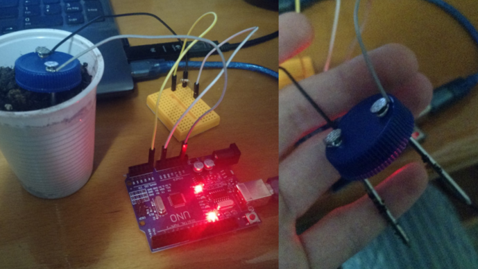
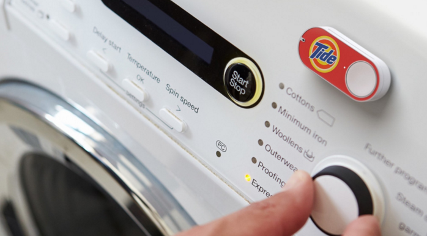
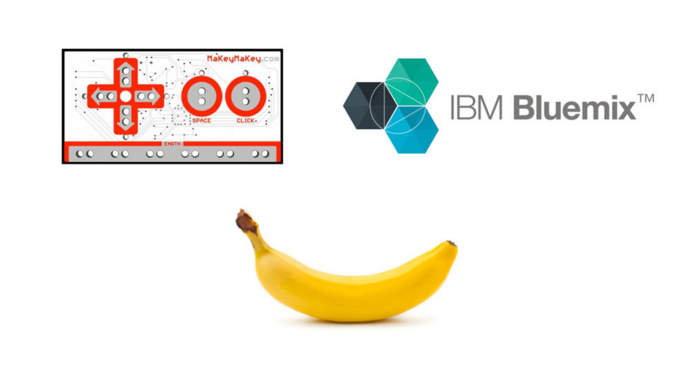
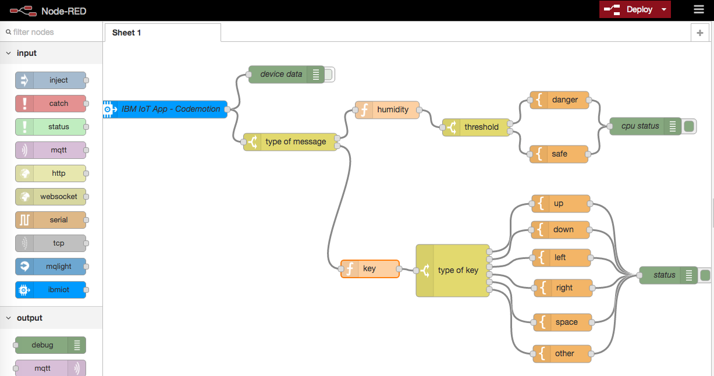

# Codemotion Spain 2015

Ejemplos, slides y recursos usados en la charla **[«Gente que hace cosas con cacharros»][1]**.  
[Codemotion Spain 2015][2]. Madrid, 28 de Noviembre de 2015.

**«Gente que hace cosas con cacharros»** es una charla de: 
- [Miguel Ángel López  - @MiguelAngel_LV][3]
- [José Juan Sánchez - @josejuansanchez][4]

## Descripción de la charla:

Demostraremos a base de **experimentos muy absurdos** que todos los cacharros tienen cabida en la **Internet de las Cosas**. 
Desde ese HTC Magic que estás pensando en tirar, hasta la tarjeta de red que te dió tu primo, o incluso el ATtiny ese al que le faltan 2 patillas.

Si alguna vez hablando con tu madre has usado en una frase al menos 6 de estas palabras: 
**Android, Arduino, ATtiny, Sensores, UDOO, Makey Makey, Piticli Bonico, Raspberry Pi, BLE, MQTT**, entonces no deberías perderte esta charla.

## Slides

[][11]

## Vídeos usados en la charla: 
* [Makey Makey + Protocoder][5]
* [Corbata Led + Arduino][6]
* [Voice controlled MiniSkybot 2][7] 
* [Toy Hacking with Arduino][8] 
* [Grifo][9]
* [Unity + Arduino + Ultrasonic sensor][10]

[1]: http://2015.codemotion.es/agenda.html#5699289732874240/43004009
[2]: http://2015.codemotion.es
[3]: http://twitter.com/MiguelAngel_LV
[4]: http://twitter.com/josejuansanchez
[5]: https://www.youtube.com/watch?v=HVs_Mmu2jhY 
[6]: https://www.youtube.com/watch?v=-wGTGrFWI_0 
[7]: https://www.youtube.com/watch?v=tZbb-6FMFSw 
[8]: https://www.youtube.com/watch?v=YxQ4TBid01g 
[9]: https://vimeo.com/141407573 
[10]: https://www.youtube.com/watch?v=cMYkwnPLnLU
[11]: https://speakerdeck.com/josejuansanchez/gente-que-hace-cosas-con-cacharros

## Experimento 1

## Experimento 2

## Node-Red

